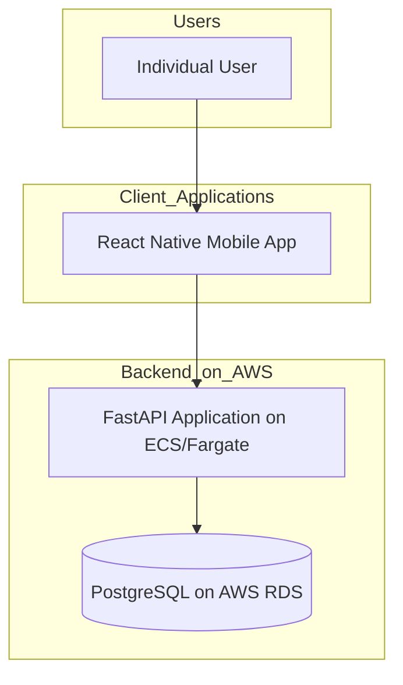

# Monkey Logs Fullstack Architecture Document

This document has been collaboratively generated to define the complete architecture for the Monkey Logs application.

## 1. Introduction

This document outlines the complete fullstack architecture for **Monkey Logs**, including backend systems, frontend implementation, and their integration. It serves as the single source of truth for AI-driven development, ensuring consistency across the entire technology stack.

This unified approach combines what would traditionally be separate backend and frontend architecture documents, streamlining the development process for modern fullstack applications where these concerns are increasingly intertwined.

### 1.1. Starter Template or Existing Project

N/A - Greenfield project. The project will be built from scratch based on the architectural decisions outlined in this document, without using a pre-existing starter template.

### 1.2. Change Log

| Date       | Version | Description   | Author  |
| :--------- | :------ | :------------ | :------ |
| 2025-09-23 | 1.0     | Initial draft | Winston |

## 2. High-Level Architecture (Individual-First)

This section provides a comprehensive overview of the system's structure, from the underlying infrastructure to the architectural patterns that will guide development, with a focus on delivering the core individual user experience first.

### 2.1. Technical Summary

The Monkey Logs application will be a full-stack system built within a **monorepo** to facilitate code sharing and atomic changes. The architecture features a **React Native** mobile app for Individual users and a planned **React (with TypeScript)** web portal for Coaches. Both clients will communicate with a central **FastAPI** backend via a unified REST API. This Python-based backend will leverage **SQLModel** for data operations against a **PostgreSQL** database. The entire system is designed to be deployed on a flexible cloud infrastructure.

### 2.2. Platform and Infrastructure Choice

- **Recommendation: Vercel for Frontend + AWS for Backend**
  - **Platform:** Vercel (Web Portal) & AWS (API & Database)
  - **Key Services:** Vercel Hosting, AWS RDS (for PostgreSQL), AWS ECS/Fargate (for FastAPI container).
  - **Rationale:** This "best-of-breed" approach leverages Vercel's industry-leading platform for the web frontend and the robust, scalable AWS platform for the backend and database.

### 2.3. Repository Structure

- **Structure:** Monorepo
- **Monorepo Tool:** `npm` or `yarn` workspaces.
- **Package Organization:**
  - `apps/`: Will contain the `api`, `mobile`, and future `web` applications.
  - `packages/`: Will house shared code, such as `shared-types`.

### 2.4. High-Level Architecture Diagram

### 2.5. Architectural Patterns

- **Monorepo:** To manage the entire codebase in a single repository.
- **Component-Based UI:** For building the React Native application.
- **Centralized State Management (Redux Toolkit):** To manage application-wide state.
- **Repository Pattern (Backend):** To abstract data access logic.
- **REST API:** For client-server communication.

## 3. Tech Stack

| Category                 | Technology                             |
| :----------------------- | :------------------------------------- |
| **Frontend Language**    | TypeScript                             |
| **Frontend Framework**   | React Native (Mobile), React (Web)     |
| **UI Component Library** | NativeBase (Mobile), Material-UI (Web) |
| **State Management**     | Redux Toolkit                          |
| **Backend Language**     | Python                                 |
| **Backend Framework**    | FastAPI                                |
| **API Style**            | REST                                   |
| **Database**             | PostgreSQL                             |
| **Cache**                | Redis                                  |
| **File Storage**         | AWS S3                                 |
| **Authentication**       | JWT                                    |
| **Frontend Testing**     | Jest & React Native Testing Library    |
| **Backend Testing**      | Pytest                                 |
| **E2E Testing**          | Playwright                             |
| **Build Tool**           | Metro (Mobile), Vite (Web)             |
| **Backend Dependencies** | Poetry                                 |
| **CI/CD**                | GitHub Actions                         |
| **Monitoring**           | Sentry                                 |
| **Logging**              | AWS CloudWatch                         |

## 4. Data Models

(Summary of the final, set-centric, session-based model)

- **User:** Represents an individual user of the application.
- **Exercise:** The definition of an exercise, with a `type` discriminator (e.g., `STRENGTH_REPS`, `HANGBOARD`).
- **WorkoutSession:** A container for a specific day's training activities.
- **ExerciseLog:** A record of a single performed exercise within a session. Contains a `sets` JSONB field to store an array of detailed set objects (reps, weight, rest, etc.).
- **ClimbLog:** A record of a single climbing activity.
- **WorkoutTemplate:** A reusable workout definition, composed of `ActivityGroup`s.
- **ActivityGroup:** A group of one (`SINGLE`) or more (`SUPERSET`) exercises within a template.

## 5. API Specification

The API will be a REST API defined with the OpenAPI 3.0 standard. It will feature endpoints for managing all data models, such as `POST /sessions` and `POST /logs/workout`. The API will use a discriminator pattern to handle the polymorphic `ExerciseLog` data.

## 6. Components

- **Backend:** `AuthRouter`, `LogsRouter`, `TrainingRouter` using FastAPI.
- **Frontend (Mobile):** `ApiClientService`, `WorkoutLogger` using React Native.
- **Shared:** `shared-types` package for TypeScript interfaces.

## 7. External APIs

No external third-party APIs are required for the MVP.

## 8. Core Workflows

Three primary workflows were defined with sequence diagrams:

1.  **Structured Logging:** Using a template to start a session and log workouts.
2.  **Ad-Hoc Logging:** Creating a session on the fly and logging exercises.
3.  **Editing a Workout:** Modifying a completed `ExerciseLog` within a session.

## 9. Database Schema

A PostgreSQL schema was defined using SQL DDL. The key feature is the `workout_logs` table, which uses a `JSONB` column named `sets` to flexibly store the detailed performance data for different exercise types.

## 10. Frontend Architecture

The mobile app will be built with React Native and organized by feature. Key patterns include:

- **State Management:** Redux Toolkit.
- **Routing:** React Navigation.
- **Services:** A dedicated API service layer to handle all HTTP communication.

## 11. Backend Architecture

The API will be built with FastAPI and deployed as a Docker container on AWS Fargate. Key patterns include:

- **Structure:** Organized by feature (`routers`, `services`, `db`).
- **Data Access:** Repository Pattern to abstract database logic.
- **Authentication:** JWT-based security with protected routes.
- **Custom Types:** Use of Pydantic custom types for IDs for improved readability and type safety.

## 12. Unified Project Structure

A monorepo managed by Yarn Workspaces will contain the `apps/` (api, mobile, web) and `packages/` (shared-types) directories. The backend will use Poetry for dependency management.

## 13. Development Workflow

A developer will use `yarn install` and `poetry install` to set up the project. A `docker-compose` file will provide the database. Root-level scripts (`yarn dev`, `yarn test`) will run the applications.

## 14. Deployment Architecture

A CI/CD pipeline using GitHub Actions will deploy the applications:

- **API:** Containerized and deployed to AWS Fargate.
- **Web App:** Deployed to Vercel.
- **Mobile App:** Built via a cloud service (EAS Build) and submitted to app stores.

## 15. Security and Performance

- **Security:** JWTs stored securely (HttpOnly cookie for web, Keychain for mobile), password hashing (bcrypt), strict CORS, input validation via Pydantic.
- **Performance:** Client-side caching (TanStack Query), server-side caching (Redis), database indexing, and code-splitting/virtualization on the frontend.

## 16. Testing Strategy

A testing pyramid approach will be used:

- **Unit Tests:** Jest (Frontend), Pytest (Backend).
- **Integration Tests:** React Testing Library, Pytest.
- **E2E Tests:** Playwright.

## 17. Coding Standards

Key rules include using the `shared-types` package, abstracting API and DB access, and using defined naming conventions.

## 18. Error Handling Strategy

A unified strategy involves a standard JSON error format from the API, global error handling in the client (axios interceptors), and custom exception handlers in the backend, with all errors reported to Sentry.

## 19. Monitoring and Observability

- **Stack:** Sentry (Error/Performance), AWS CloudWatch (Logging/Infrastructure).
- **Metrics:** API health (rate, error, latency), database performance, and frontend vitals will be tracked.

## 20. Checklist Results Report

(This section will be populated next.)
